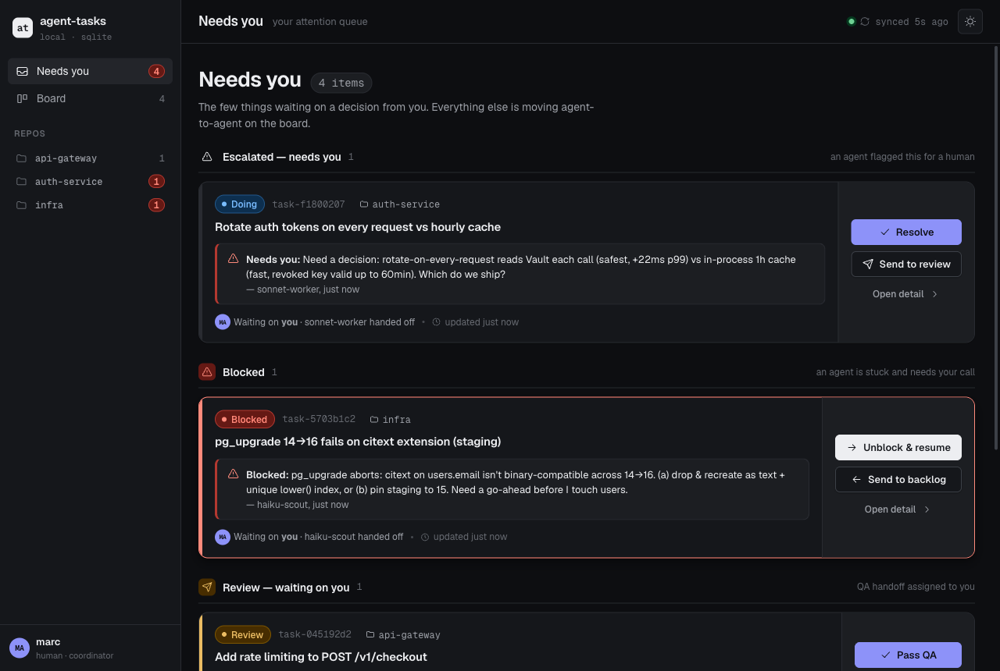

<div align="center">
<h1>📋 relay</h1>
<p>A local-first task tracker for coordinating work across AI agents</p>
</div>

---

<p align="center">
  
</p>

One agent logs a task, another claims and does it, then hands it off for QA. A coordinator polls
for the handoff, checks the work, and either passes it or sends it back with a note. The list is a
single durable store on your machine, shared across every session and git worktree — so agents in
different windows (and you) all see the same queue.

## Install

```bash
curl -fsSL https://raw.githubusercontent.com/maferland/relay/main/install.sh | bash
```

Builds from source (needs [Bun](https://bun.sh)) and installs the `relay` binary to
`~/.local/bin`, the `using-relay` skill to `~/.claude/skills`, and registers the MCP server
with Claude Code. Re-run any time to update. Or clone and `./install.sh` from the checkout.

Already installed? `relay upgrade` downloads the latest release binary (verifying its checksum),
and `relay --version` prints what you're on. relay also checks for a newer release about once a day
and prints a one-line nudge in an interactive terminal; set `RELAY_NO_UPDATE_CHECK=1` to silence it.

## Usage

Set who you are, then log and hand off work:

```bash
export RELAY_ACTOR=lead

relay add "Fix the login redirect loop" --assignee worker-1
relay list --state todo                     # what's queued

# worker picks it up, does it, hands off for QA
RELAY_ACTOR=worker-1 relay claim task-1a2b3c4d
RELAY_ACTOR=worker-1 relay update task-1a2b3c4d --state review --note "ready for QA"

# coordinator polls the handoff queue, then QAs
relay list --state review
relay update task-1a2b3c4d --state done --note "QA passed"
# …or send it back (a note is required):
relay update task-1a2b3c4d --state todo --note "logout 500s — see step 3"

relay show task-1a2b3c4d                     # full back-and-forth history
```

States flow `todo → doing → review → done`, with `blocked` to the side. `review` is the
QA-handoff signal. Any send-back (a backward move or `blocked`) requires a `--note`, so the next
actor always knows why.

Tag work with free-form labels (orthogonal to state) and filter on them, for review granularity
without new states. Leave a note on the thread without a state change with `relay comment`:

```bash
relay add "fix auth" --label awaiting-code-review
relay update task-1a2b3c4d --add-label code-reviewed --rm-label awaiting-code-review
relay list --label code-reviewed
relay comment task-1a2b3c4d "what did you mean by 'the redirect case'?"
```

### Web UI

A local web view of what needs you — escalated, blocked, reviews assigned to you, and your queue:

```bash
relay ui --me <your-name>     # opens a local browser UI over the same store
```

Three views: the Needs-you inbox, a board (list + drag-to-move kanban), and a task detail with the
full history timeline and a comment composer.

### MCP

The same operations are available to agents as MCP tools:

```bash
claude mcp add relay -- relay mcp
```

Exposes `add_task`, `list_tasks`, `get_task`, `update_task`, `claim_task` over the same store.

## Requirements

- [Bun](https://bun.sh) to build from source. The compiled binary has no runtime dependency.

## License

[MIT](LICENSE)
